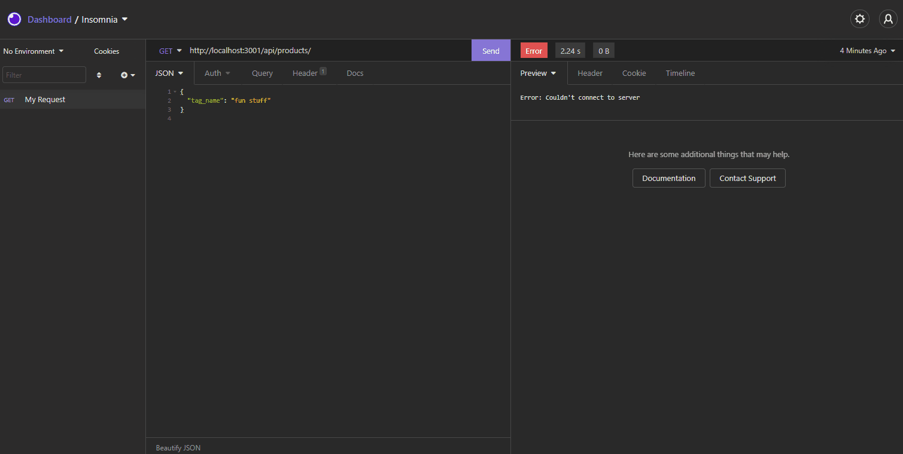

# Object-Relational Mapping (ORM): E-Commerce Back End

[](https://www.gnu.org/licenses/gpl-3.0)

## Description

This project sets up the Back End database and API routes to access that database using MySQL, the Sequelize library and Express.js



The code and all relevant files can be found at [https://github.com/perez-rob/ECommerce-BackEnd](https://github.com/perez-rob/ECommerce-BackEnd).

A video demonstration of the project can be downloaded in MP4 format here: [https://github.com/perez-rob/ECommerce-BackEnd/blob/main/HW-13-demo.mp4](https://github.com/perez-rob/ECommerce-BackEnd/blob/main/HW-13-demo.mp4)

## Table of Contents

- [Installation](#installation)

- [Features](#features)

- [Usage](#usage)

- [Credits](#credits)

- [Questions](#questions)

- [License](#license)

## Installation

1. Navigate to [https://github.com/perez-rob/ECommerce-BackEnd](https://github.com/perez-rob/ECommerce-BackEnd)

2. Clone the repository to your local machine

3. Open your preferred CLI (Terminal, GitBash, etc.) and cd to the directory where you cloned the repo

4. Use the following command to install the required dependencies (dependency information can be found in [package.json](./package.json))

```
npm ci
```

## Features

This project allows interaction and manipulation of an eCommerce database, allowing the user to:

- Create Categories, Products, and Product Tags

- Read Categories, Products, and Product Tags

- Update Categories, Products, and Product Tags

- Delete Categories, Products, and Product Tags

## Usage

To use this Team Profile Generator:

1. Using your Terminal or GitBash, cd to the project directory and use the following to open the MySQL shell

```
mysql -u root -p
```

2. Enter your MySQL password then run the following command to create the eCommerce database:

```
source db/schema.sql
```

3. Quit the MySQL shell and run the following in Terminal/GitBash to seed the database with test data

```
npm run seed
```

4. Start the server with:

```
npm start
```

5. Use [Insomnia](https://insomnia.rest/) or another API platform to interact with the database through API routes using the following URLs:

- for GET or POST requests of Categories, Products, or Tags use the following, respectively:

```
http://localhost:3001/api/categories
http://localhost:3001/api/products
http://localhost:3001/api/tags
```

- for GET, PUT, or DELETE requests of specific (e.g. the first instance) Categories, Products, or Tags use the following, respectively:

```
http://localhost:3001/api/categories/1
http://localhost:3001/api/products/1
http://localhost:3001/api/tags/1
```

## Credits

Solo project for GATech Coding Bootcamp
by Rob Perez

- [Portfolio Page](www.robperez.net)
- rob@robperez.net
- 404.317.5336

## Questions

If you have any questions about the repo, open an issue or contact me directly at rob@robperez.net. You can find more of my work at [github/perez-rob](https://github.com/perez-rob).

## License

This project is licensed under the [GPL v3 License](https://www.gnu.org/licenses/gpl-3.0).
